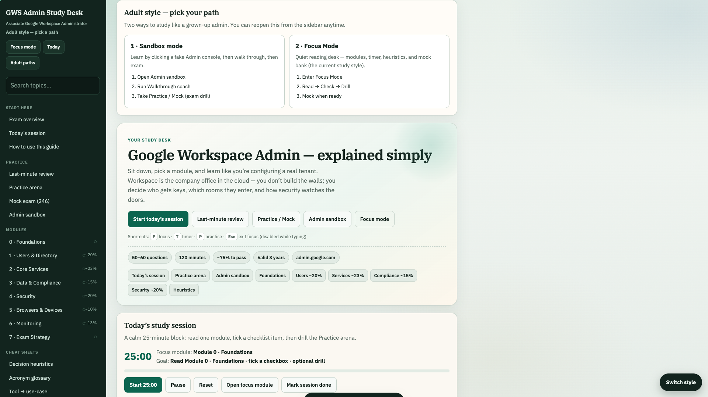
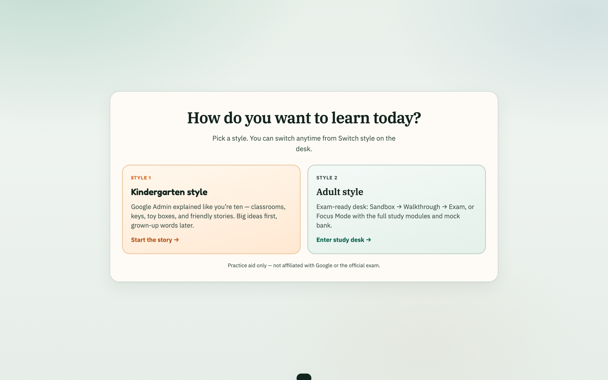
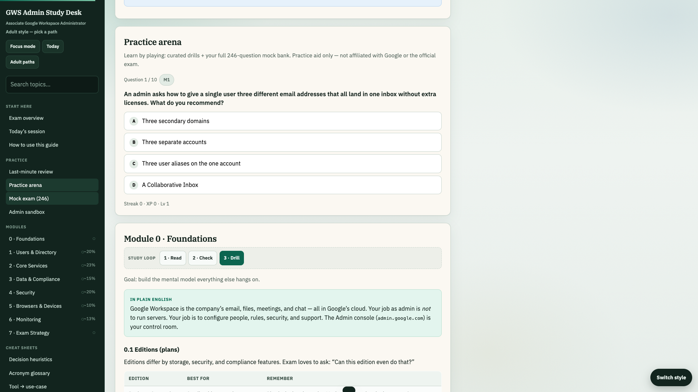
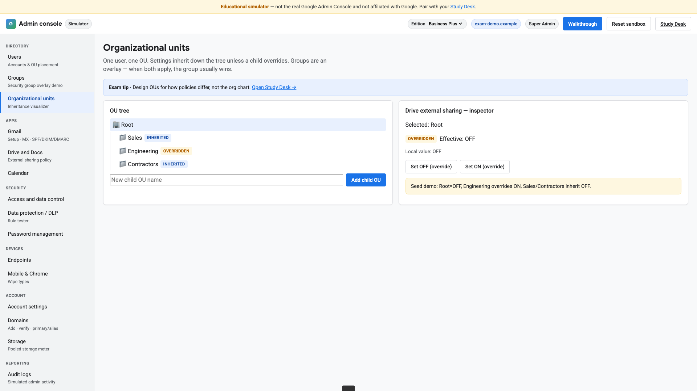

# GWS Admin Study Desk

[](https://gws-admin-study-guide.vercel.app/)
[](https://gws-admin-study-guide.vercel.app/)
[](LICENSE)

**Associate Google Workspace Administrator** study companion — structured notes, a hands-on admin sandbox, and a **246-question** practice bank. Works in the browser (mobile-friendly), with optional **Mac** and **Windows** desktop builds.

> Personal portfolio project. Not affiliated with Google or the official certification exam.

<p align="center">
  <a href="https://gws-admin-study-guide.vercel.app/">
    
  </a>
</p>
<p align="center"><em>Adult study desk (Aug 2026): pick Notes, Labs, or Prove. Login is optional.</em></p>

---

## Live app

**[https://gws-admin-study-guide.vercel.app/](https://gws-admin-study-guide.vercel.app/)**

| Area | What you get |
|------|----------------|
| **Ticket clinic** | Five job tickets that jump into the fail-state sandbox |
| **Study desk** | Searchable modules; optional 25-minute timer |
| **Learning styles** | *Kindergarten* (story-based) or *Adult* exam desk |
| **Practice** | Start with 10 questions; timed mock and full **246-question** bank in other modes |
| **Sandbox** | Interactive Admin Console simulator + 30 labs |
| **Mail setup demo** | Separate page: add a domain, publish MX/SPF/DKIM/DMARC at a fake DNS host, create a mailbox, send tests |
| **Cloud profile** | Optional — study on this device, or log in to sync |

---

## Highlights (portfolio)

- **Single-page study app** — vanilla HTML/CSS/JS, no framework lock-in; fast to host as static files.
- **Full mock exam bank** — 246 items parsed into structured JSON for timed and untimed modes.
- **Dual delivery** — same codebase for **Vercel** (auto-deploy from Git) and **Electron** (Mac `.app` / Windows zip installer).
- **Auth & sync** — custom username/password API on **Supabase Edge Functions** + Postgres; client never sees service keys.
- **Mobile UX** — drawer nav, safe areas, touch-friendly controls, account panel on small screens.

---

## Tech stack

| Layer | Tools |
|-------|--------|
| Frontend | HTML, CSS, JavaScript (localStorage + profile sync) |
| Hosting | [Vercel](https://vercel.com) (static + build hook for `config.js`) |
| Backend | Supabase (Postgres, Edge Function `gws-study-api`) |
| Desktop | Electron + electron-builder |
| CI | GitHub Actions workflow template in `scripts/ci/` |

---

## Project structure

```text
gws-admin-study-guide/
├── index.html              # Main Study Desk
├── gws-admin-console.html  # Admin sandbox simulator
├── gws-domain-setup.html   # Domain + MX/SPF/DKIM/DMARC walkthrough
├── data/
│   ├── mock-bank.js        # 246-question bank
│   ├── gws-exam-coverage.js # Official exam-guide → notes/lab/quiz map
│   └── gws-auth.js         # Login + cloud sync client
├── electron/               # Desktop shell
├── supabase/
│   ├── functions/gws-study-api/
│   └── migrations/
├── scripts/                # Vercel config + installers
└── vercel.json
```

---

## Run locally

```bash
git clone https://github.com/azibfikri/GWS_AdminTrainingSelfLearn.git
cd GWS_AdminTrainingSelfLearn
npm install
node scripts/write-config.js   # writes config.js for cloud login
open index.html                # or: npm start (Electron)
```

Cloud login uses the hosted API by default (`config.example.js`). Progress still works offline on-device without signing in.

---

## Desktop builds

| Platform | Command | Output |
|----------|---------|--------|
| Mac | `npm run pack:mac` | `dist/mac-arm64/*.app` |
| Mac DMG | `npm run dist:mac` | DMG installer |
| Windows (from Mac) | `npm run dist:win:setup` | Zip + `Install.bat` |
| Windows NSIS | Copy `scripts/ci/build-windows.yml` → `.github/workflows/` on GitHub, or run `npm run dist:win` on Windows |

---

## Cloud accounts

1. Open the live site → **Log in** / **Sign up** (sidebar or mobile **Account**).
2. Username: 3–32 characters (`a–z`, `0–9`, `_`). Password: at least 6 characters.
3. Checklist, XP, timer, learning style, and sandbox state sync after login (~2s debounce; **Sync now** anytime).

---

## Deploy (Vercel)

Connected to this Git repo: pushes to `main` trigger production deploy.

Build step: `node scripts/write-config.js` (see `vercel.json`).

Optional env overrides:

- `GWS_AUTH_API_BASE` — Edge Function URL  
- `GWS_SUPABASE_ANON_KEY` — Supabase gateway anon key  

---

## Screenshots

| | |
|:---:|:---:|
| **Learning styles** — Kindergarten stories or adult exam desk | **Practice arena** — Start 10 questions |
| [](https://gws-admin-study-guide.vercel.app/) | [](https://gws-admin-study-guide.vercel.app/#practice) |
| **Admin sandbox** — lab catalog in Google Admin chrome | **Study desk** — Notes / Labs / Prove |
| [](https://gws-admin-study-guide.vercel.app/gws-admin-console.html#labs) | [](https://gws-admin-study-guide.vercel.app/) |

All captures from the [live demo](https://gws-admin-study-guide.vercel.app/). Full-size files live in [`docs/screenshots/`](docs/screenshots/).

---

## Author

**Azib Fikri** — built for certification prep and as a full-stack static + edge + desktop sample.

If this repo helps your studies or your portfolio review, a star is appreciated.

---

## Disclaimer

Educational study aid only. Google, Google Workspace, and related marks are trademarks of Google LLC.
